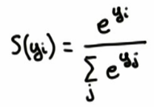

# Machine Learning to Deep Learning

深度学习
- 我们可以在Personal Computer上完成庞大的任务
- 深度学习是一种适应于各类问题的万能药

神经网络
- 神经网络出现于80年代，但当时计算机运行慢，数据集很小，神经网络不适用
- 现在神经网络回来了，因为能够进行GPU计算，可用使用的数据集也变大

分类

> 分类的一些讨论可以在[这个项目](https://github.com/ahangchen/GoogleML/blob/master/note/lesson-2-viz/README.md)里看到

- Machine Learning不仅是Classification！但分类是机器学习的核心。
- 学会分类也就学会了Detect和Rank
  - Detect：从复杂场景中识别某类物品
  - Rank：从各种链接中找到与某个关键词相关的一类链接

- Logistic Classification
    > simple but important classifier
     
    About
    
    - train your first simple model entirely end to end
    - download and pre-process some images for classification
    - run an actual logistic classifier on images data
    - connect bit of math and code
    
    Detail
    - linear classifier
    
    
    
    > 之所以这样建模，是因为线性公式是最简单的数学模型，仅此而已。
    
    - Input: X (e.g. the pixels in an image)
    - apply a linear function to X
      - Giant matrix multiply 
      - take inputs as a big vector 
      - multiply input vector with a matrix, W means weights
      - b means biased term
      - machine learning 调整 weights and bias以达到最好的预测效果
    - Output: Y, predictions for per output class
      - Y is a vector, represents the probability of each label
      - 好的预测中，正确的label的概率应当更接近1
      - 往往得到的Y一开始不是概率，而是一些具体值（scores/logits），所以需要转换，by：
      
      > Softmax回归模型：[Wikipedia](http://ufldl.stanford.edu/wiki/index.php/Softmax%E5%9B%9E%E5%BD%92) 
      
      
      
      - 代码[soft_max.py](../../src/soft_max.py)：Softmax实现与应用
      
    

- Stochastic Optimization
- Data & Parameter tuning

> general data practices to train models
