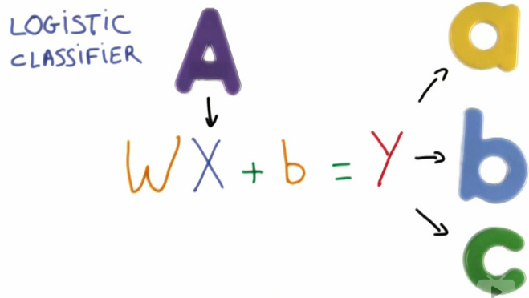
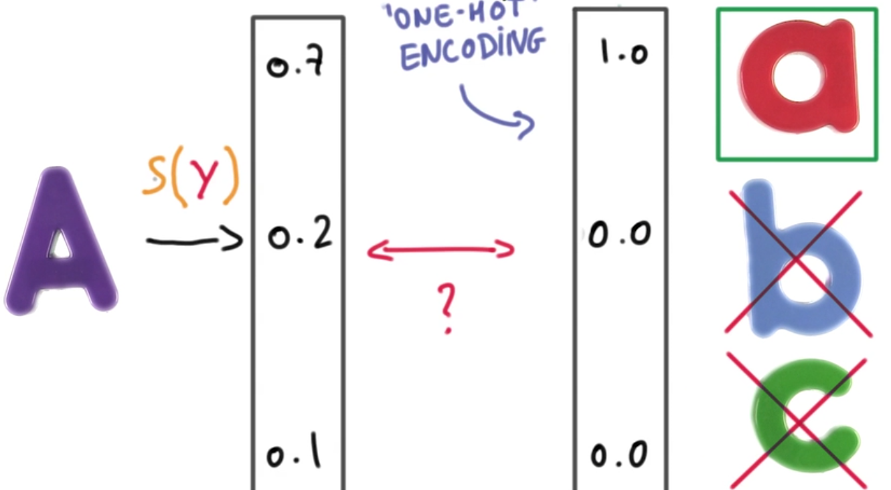
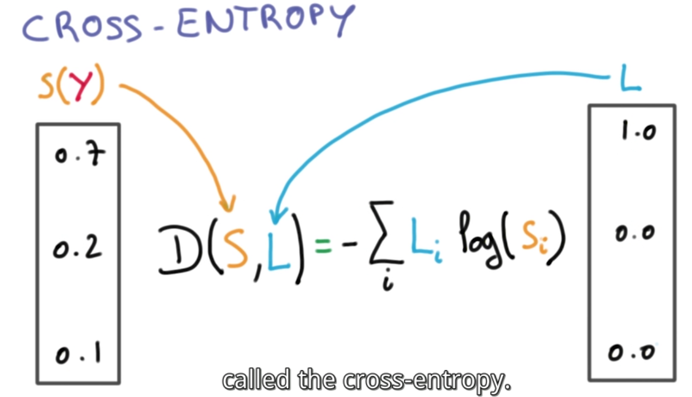
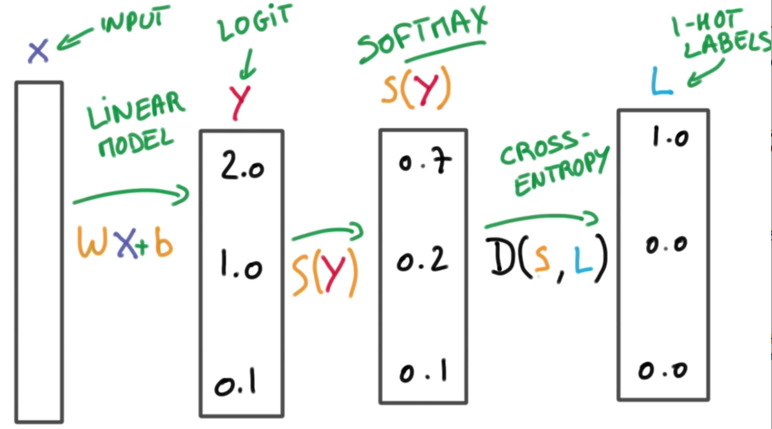
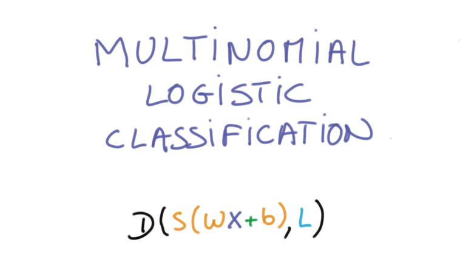
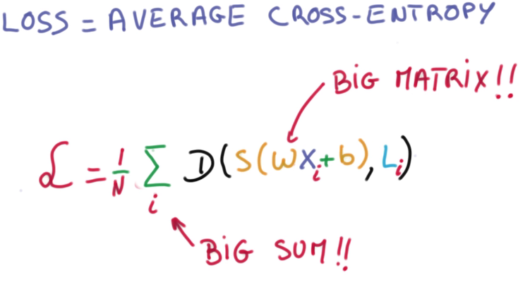
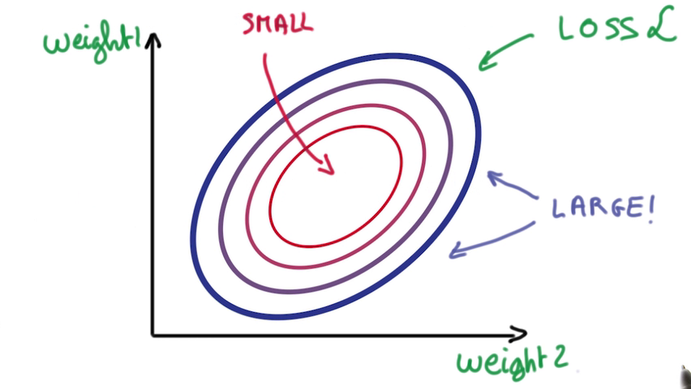
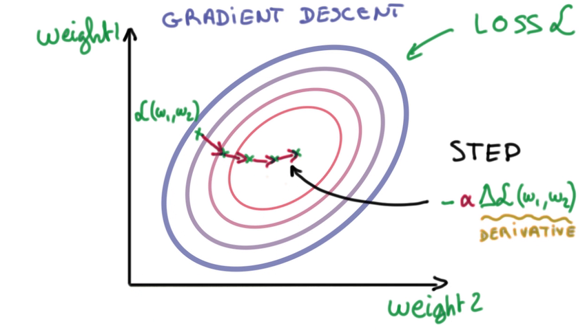

# Logistic Classification

>
Github工程地址：https://github.com/ahangchen/GDLnotes
>
欢迎star，有问题可以到[Issue区](https://github.com/ahangchen/GDLnotes/issues)讨论
>
官方教程[地址](https://classroom.udacity.com/courses/ud730/lessons/6370362152/concepts/63798118170923)
>
[视频](http://d2uz2655q5g6b2.cloudfront.net/6370362152/L1%20Machine%20Learning%20to%20Deep%20Learning%20Videos.zip)/[字幕](http://d2uz2655q5g6b2.cloudfront.net/6370362152/L1%20Machine%20Learning%20to%20Deep%20Learning%20Subtitles.zip)下载

     
## About

> simple but important classifier

- Train your first simple model entirely end to end
- 下载、预处理一些图片以分类
- Run an actual logistic classifier on images data
- Connect bit of math and code

## detail
### linear classifier

> 之所以这样建模，是因为线性公式是最简单的数学模型，仅此而已。

- Input: X (e.g. the pixels in an image)
- Apply a linear function to X
  - Giant matrix multiply 
  - Take inputs as a big vector 
  - Multiply input vector with a matrix, W means weights
  - b means biased term
  - Machine learning adjust weights and bias for the best prediction
- Output: Y, predictions for per output class
  - Y is a vector, represents the probability of each label
  - 好的预测中，正确的label的概率应当更接近1
  - 往往得到的Y一开始不是概率，而是一些具体值（scores/logits），所以需要转换，by：
  
  > Softmax回归模型：[Wikipedia](http://ufldl.stanford.edu/wiki/index.php/Softmax%E5%9B%9E%E5%BD%92) 
  
  
### Softmax  
  - 代码 [soft_max.py](../../src/soft_max.py)：Softmax实现与应用
  - input的score差异越大（可以全部乘10试试），则输出的各项label概率差异越大，反之差异越小
  - Softmax只关心几个label之间的概率，不关心具体值
  - 机器学习是一个让预测成功率升高的事情，因此是一个让score之间差异增大的过程
  
### One hot encoding

> 正确预测结果应当是只有一个label成立，其他label不成立。这种情况下，预测概率最大的则是最可能的结果。

> Example: take this [test](https://classroom.udacity.com/courses/ud730/lessons/6370362152/concepts/63713510510923) 

  - one hot encoding在label很多的情况下not work well，因为output vector到处都是0，很稀疏，因此效率低
    - solved by [embeddings](../lesson-4/README.md)
  - 好处：可以measure我们与理想情况之间的距离（compare two vectors）
  
  > 分类器输出：[0.7 0.2 0.1] \<=\> 与label对应的真实情况：[1 0 0]
  
  - compare two vectors: cross-entropy
  
  
  - D(S, L) != D(L, S)
    
  > Remember: Label don't log, for label zero 
 
### 小结
 
 
 
 
 找到合适的W和b，使得S和L的距离D的平均值，在整个数据集n中最小。
 
### 最小化cross-entropy
 
 
 
 D的平均值即是Training loss，求和和矩阵相乘是个大数据的活。
 
 
 
 两个参数的误差导致一个呈圆形的loss，所以我们要做的就是找到尽量靠近圆心的weight
 > 机器学习问题变成了一个数值优化
   - 解决方法之一：Gradient descent，求导
   
   
   
   > 修改参数，检查误差是否变大，往变小的方向修改，直到抵达bottom。
   
   > 图中weight是二维的，但事实上可能有极多的weight
   
[下一节](practical.md)实践

> 如果觉得我的文章对您有帮助，请随意打赏～

