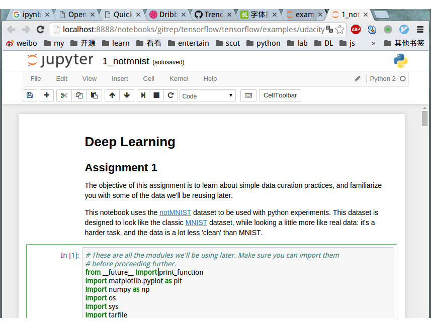

# Practical Aspects of Learning

> 课程目标：学习简单的数据展示，熟悉以后要使用的数据

## Install Ipython NoteBook

可以参考这个[教程](http://opentechschool.github.io/python-data-intro/core/notebook.html)

- 可以直接安装[anaconda](https://www.continuum.io/downloads)，里面包含了各种库，也包含了ipython；
- 推荐使用python2的版本，因为很多lib只支持python2，而且python3在升级中，支持3.4还是3.5是个很纠结的问题。
- 安装anaconda后直接在终端输入 ipython notebook，则会运行一个ipython的server端，同时在你的浏览器中打开基于你终端目录的一个页面：

- 点开ipynb文件即可进入文件编辑页面


上图即为practical部分的教程，可以在github[下载](https://github.com/tensorflow/tensorflow/tree/master/tensorflow/examples/udacity)

官方推荐使用docker来进行这部分教程，但简单起见我们先用ipython notebook

## Install TensorFlow

安装教程就在TensorFlow的github页上>>>[点击查看](https://github.com/tensorflow/tensorflow/blob/master/tensorflow/g3doc/get_started/os_setup.md)

按照官方的流程装就好了，这里讲一下几种方式的特点：
1. pip: 安装在全局的python解释器中，简单
2. Third party: Virtualenv, Anaconda and Docker：都能创建tensorflow独立的编译环境，但就是多了一份包
3. Source: 能够适应不同的python版本（比如编译一个3.5版的），但源码编译可能有许多坑

- ubuntu安装时，需要注意自己的python - pip - tensorflow版本是否对应（比如是否都是2.7），
- 使用sudo命令时，注意自己的环境变量是否变化（会导致pip或python命令对应的版本变化）
- 具体讲一下ubuntu安装tensorflow流程：
  - 安装anaconda2
  - 确定自己终端的pip和python版本：
  ```
    $ pip -V && python -V
  ```
    确认使用的是否都来自anaconda，如果不是，则应该使用类似这样的命令运行对应的pip：
  ```
    $ /home/cwh/anaconda2/bin/pip -V
  ```
    使用sudo命令时最好也看一下版本
    
  - 使用anaconda创建一个tensorflow虚拟环境：
  ```
    $ conda create -n tensorflow python=2.7
  ```
  - 切换到tensorflow环境下（实际上是更换了环境变量里的pip和python），下载安装tensorflow，需要sudo权限
  ```
    $ source activate tensorflow
    (tensorflow)$ sudo pip install --ignore-installed --upgrade https://storage.googleapis.com/tensorflow/linux/cpu/tensorflow-0.8.0rc0-cp27-none-linux_x86_64.wh
    $ source deactivate
  ```
  注意如果安装的是gpu版本，还需要按照官网说明安装cuda和cudaCNN
  
  - 安装成功后就可以在tensorflow的python环境下，执行import tensorflow看看了。
   
## notMNIST

修改的[MNIST](http://yann.lecun.com/exdb/mnist/)，不够干净，更接近真实数据，比MNIST任务更困难。

我将官方教程的一个文件拆成了多个，然后在[schedule.py](../../src/assign_1/schedule.py)里统一调用，在各个文件里可以执行各个部分的功能测试。

- 首先使用urlretrieve来获取数据集notMNIST_large.tar.gz和notMNIST_small.tar.gz
- 代码示例：[load_data.py](../../src/assign_1/load_data.py)

- 然后用tarfile模块来解压刚刚下载的压缩包
- 代码示例：[extract.py](../../src/assign_1/extract.py)

- 用ndimage读取一部分图片，用pickle将读取到的对象（ndarray对象的list）序列化存储到磁盘
- 用matplotlib.plot.imshow实现图片显示，可以展示任意的numpy.ndarray，详见show_imgs(dataset)
- 这里展示的是二值化图片，可以设置显示为灰度图
- 代码示例：[img_pickle.py](../../src/assign_1/img_pickle.py)
