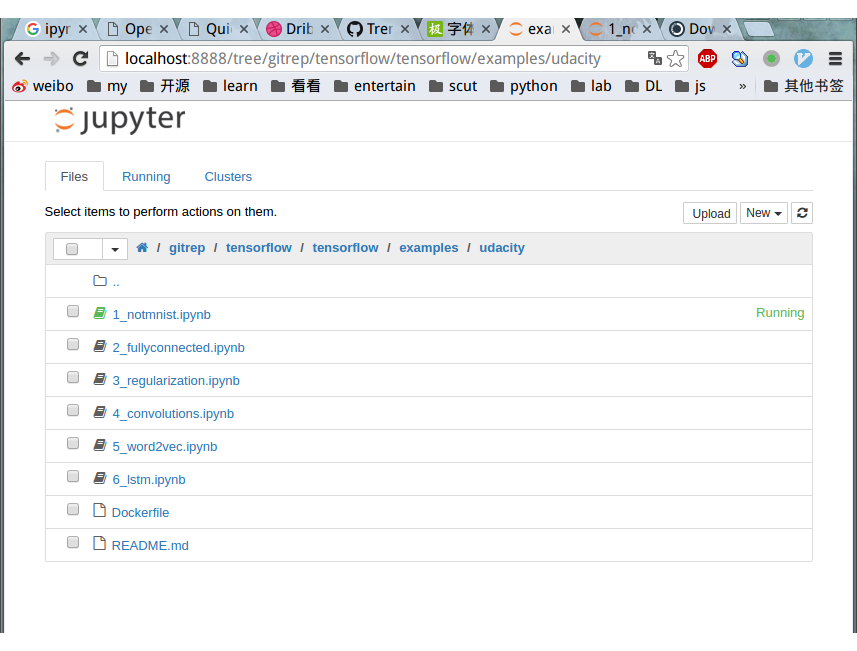

# Practical Aspects of Learning

> 课程目标：学习简单的数据展示，熟悉以后要使用的数据

## Install Ipython NoteBook

可以参考这个[教程](http://opentechschool.github.io/python-data-intro/core/notebook.html)

- 可以直接安装[anaconda](https://www.continuum.io/downloads)，里面包含了各种库，也包含了ipython；
- 推荐使用python2的版本，因为很多lib只支持python2，而且python3在升级中，支持3.4还是3.5是个很纠结的问题。
- 安装anaconda后直接在终端输入 ipython notebook，则会运行一个ipython的server端，同时在你的浏览器中打开基于你终端目录的一个页面：

- 点开ipynb文件即可进入文件编辑页面

上图即为practical部分的教程，可以在github[下载](https://github.com/tensorflow/tensorflow/tree/master/tensorflow/examples/udacity)

官方推荐使用docker来进行这部分教程，但简单起见我们先用ipython notebook

## notMNIST

修改的[MNIST](http://yann.lecun.com/exdb/mnist/)，不够干净，更接近真实数据，比MNIST任务更困难。

我将官方教程的一个文件拆成了多个，然后在[schedule.py](../../src/assign_1/schedule.py)里统一调用，在各个文件里可以执行各个部分的功能测试。

- 首先使用urlretrieve来获取数据集notMNIST_large.tar.gz和notMNIST_small.tar.gz
- 代码示例：[load_data.py](../../src/assign_1/load_data.py)

- 然后用tarfile模块来解压刚刚下载的压缩包
- 代码示例：[extract.py](../../src/assign_1/extract.py)
