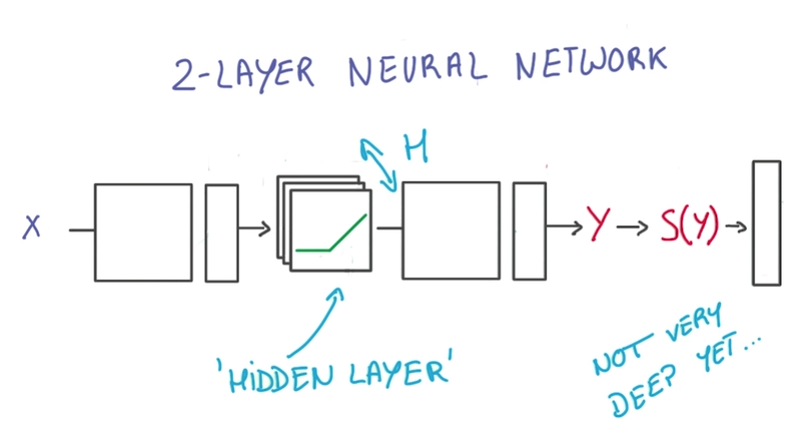
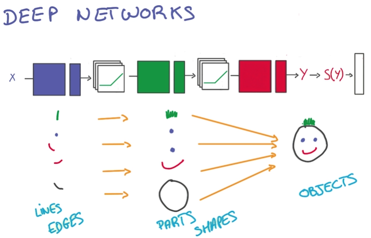
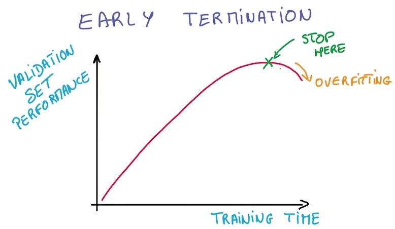
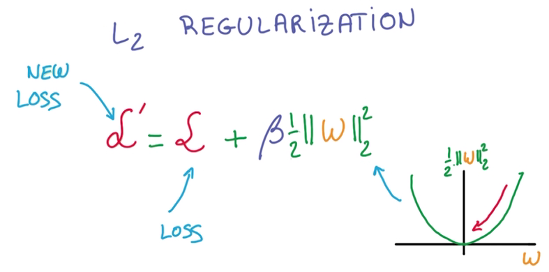
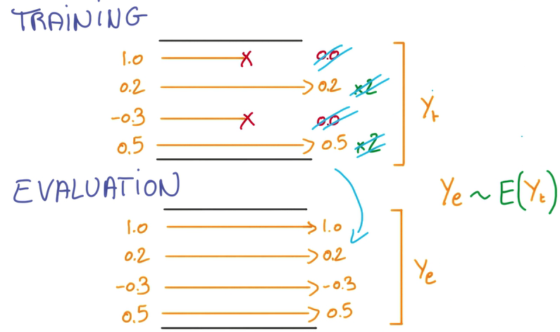

# Deep Neural Network
## Current two layer neural network:

## 优化：
- 优化RELU(隐藏层), wider
- 增加linear层，layer deeper

  - Performance: few parameters by deeper 
  - 随层级变高，获得的信息越综合，越符合目标
  
## About t-model 
- t-model只有在有大量数据时有效
- 今天我们才有高效的大数据训练方法：Better Regularization
- 难以决定适应问题的神经网络的规模，因此通常选择更大的规模，并防止过拟合

## Avoid Overfit
### Early Termination
- 当训练结果与验证集符合度下降时，就停止训练

### Regulation
- 给神经网络里加一些常量，做一些限制，减少自由的参数
- L2 regularization

在计算train loss时，增加一个l2 norm作为新的损失，这里需要乘一个β（Hyper parameter），调整这个新的项的值

> Hyper parameter：拍脑袋参数→_→

  - l2模的导数容易计算，即W本身
### DropOut
最近才出现，效果极其好
- 从一个layer到另一个layer的value被称为activation
- 将一个layer到另一个layer的value的中，随机地取一半的数据变为0，这其实是将一半的数据直接丢掉
- 由于数据缺失，所以就强迫了神经网络学习redundant的知识，以作为损失部分的补充
- 由于神经网络中总有其他部分作为损失部分的补充，所以最后的结果还是OK的
- More robust and prevent overfit
- 如果这种方法不能生效，那可能就要使用更大的神经网络了

- 评估神经网络时，就不需要DropOut，因为需要确切的结果
- 可以将所有Activation做平均，作为评估的依据
- 因为我们在训练时去掉了一半的随机数据，如果要让得到Activation正确量级的平均值，就需要将没去掉的数据翻倍
