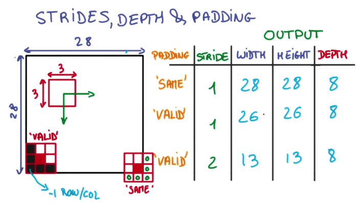

# Convolutional Networks

> deep dive into images and convolutional models

如果我们在训练前能提供一些信息，训练会更有效，

> 比如排除不必要的信息，或者指明关键信息

## Convnet
### BackGround 
- 人眼在识别图像时，往往从局部到全局
- 局部与局部之间联系往往不太紧密
- 我们不需要神经网络中的每个结点都掌握全局的知识，因此可以从这里减少需要学习的参数数量

### Weight share
- 但这样参数其实还是挺多的，所以有了另一种方法：权值共享

> Share Parameters across space

- 取图片的一小块，在上面做神经网络分析，会得到一些预测
- 将前面做好的神经网络作用于图片的每个区域，得到一系列输出

- 可以增加切片个数提取更多特征
### Concept

- Patch/Kernel：一个局部切片
- Depth: 数据的深度，图像数据是三维的，长宽和RGB，神经网络的预测输出也属于一维
- Feature Map：每层Conv网络，因为它们将前一层的feature映射到后一层（Output map）

- Stride: 移动切片的步长，影响取样的数量
- 在边缘上的取样影响Conv层的面积，由于移动步长不一定能整除整张图的像素宽度，不越过边缘取样会得到Valid Padding， 越过边缘取样会得到Same Padding
- Example 
  - 用一个3x3的网格在一个28x28的图像上做切片并移动
  - 移动到边缘上的时候，如果不超出边缘，3x3的中心就到不了边界
  - 因此得到的内容就会缺乏边界的一圈像素点，只能得到26x26的结果
  - 而可以越过边界的情况下，就可以让3x3的中心到达边界的像素点
  - 超出部分的矩阵补零就行

## Deep Convnet
在Convnet上套Convnet，就可以一层一层综合局部得到的信息

参考链接：张雨石 [Conv神经网络](http://blog.csdn.net/stdcoutzyx/article/details/41596663)