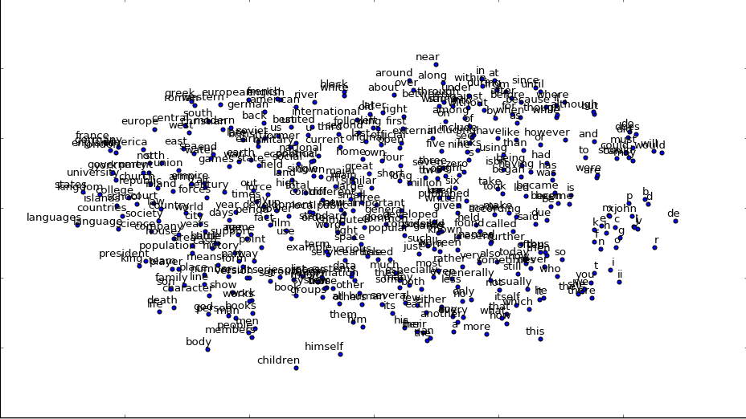
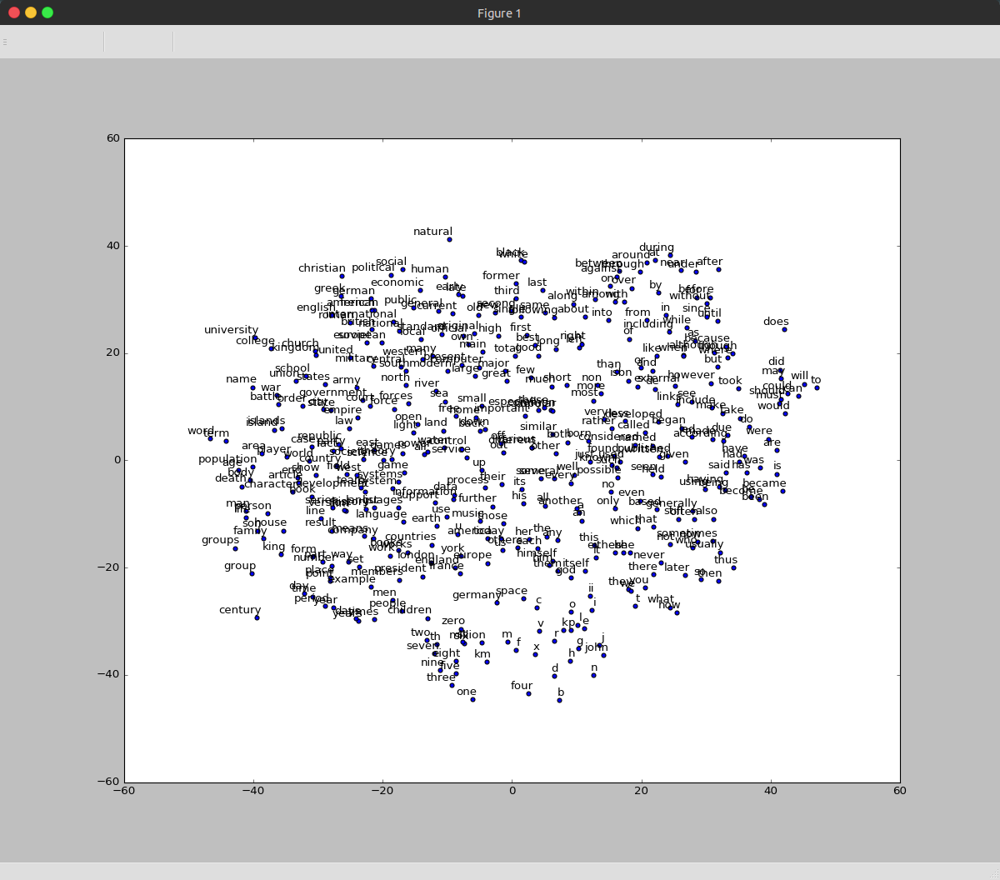

# 循环神经网络实践
## 加载数据
- 使用[text8](http://mattmahoney.net/dc/textdata)作为训练的文本数据集

text8中只包含27种字符：小写的从a到z，以及空格符。如果把它打出来，读起来就像是去掉了所有标点的wikipedia。

- 直接调用lesson1中maybe_download下载text8.zip
- 用zipfile读取zip内容为字符串，并拆分成单词list
- 用connections模块统计单词数量并找出最常见的单词


达成随机取数据的目标

## 构造计算单元

```python
embeddings = tf.Variable(
        tf.random_uniform([vocabulary_size, embedding_size], -1.0, 1.0))
```

- 构造一个vocabulary_size x embedding_size的矩阵，作为embeddings容器，
- 有vocabulary_size个容量为embedding_size的向量，每个向量代表一个vocabulary，
- 每个向量的中的分量的值都在-1到1之间随机分布

```python
embed = tf.nn.embedding_lookup(embeddings, train_dataset)
```

- 调用tf.nn.embedding_lookup，索引与train_dataset对应的向量，相当于用train_dataset作为一个id，去检索矩阵中与这个id对应的embedding

```python
loss = tf.reduce_mean(
        tf.nn.sampled_softmax_loss(softmax_weights, softmax_biases, embed,
                                   train_labels, num_sampled, vocabulary_size))
```

- 采样计算训练损失

```python
optimizer = tf.train.AdagradOptimizer(1.0).minimize(loss)
```

- 自适应梯度调节器，调节embedding列表的数据，使得偏差最小

- 预测，并用cos值计算预测向量与实际数据的夹角作为预测准确度（相似度）指标

## 传入数据进行训练
- 切割数据用于训练，其中：

```python
data_index = (data_index + 1) % len(data)
```

- 依旧是每次取一部分随机数据传入
  - 等距离截取一小段文本
  - 构造训练集：每个截取窗口的中间位置作为一个train_data
  - 构造标签：每个截取窗口中，除了train_data之外的部分，随机取几个成为一个list，作为label（这里只随机取了一个）
  - 这样就形成了根据目标词汇预测上下文的机制，即Skip-gram
- 训练100001次，每2000次输出这两千次的平均损失
- 每10000次计算相似度，并输出与验证集中的词最接近的词汇列表
- 用tSNE降维呈现词汇接近程度
- 用matplotlib绘制结果



## CBOW
上面训练的是Skip-gram模型，是根据目标词汇预测上下文，而word2vec还有一种方式，CBOW，根据上下文预测目标词汇。

实际上就是将Skip-gram中的输入输出反过来。

- 修改截取数据的方式
  - 构造标签：每个截取窗口的中间位置作为一个train_label
  - 构造训练集：每个截取窗口中，除了train_label之外的部分，作为train_data（这里只随机取了一个）
  - 这样就形成了根据上下文预测目标词汇的机制，即CBOW

- 分别从embeding里找到train_data里每个word对应的vector，用tf.reduce_sum将其相加，将相加结果与train_label比较

```python
# Look up embeddings for inputs.
embed = tf.nn.embedding_lookup(embeddings, train_dataset)
# sum up vectors on first dimensions, as context vectors
embed_sum = tf.reduce_sum(embed, 0)
```

- 训练中依旧是调节embeding的参数来优化loss
- 训练结果如下图，可以看到不同单词的接近程度



代码见：
[cbow.py](../../src/rnn/cbow.py)

## RNN 造句
整体思路是，以一个文本中的一个词作为train data，后续的所有词作为train label，从而能够根据一个给定词，预测后续的片段。

### 训练数据
- BatchGenerator
 - text: 全部的文本数据
 - text_size：全部文本的字符串长度
 - batch_size：每段训练数据的大小
 - num_unrollings：要生成的训练数据段的数目
 - segment：整个训练数据集可以分成几个训练数据片段
 - cursor：重要，
   - 一开始记录每个训练数据片段的起始位置坐标，即这个片段位于text的哪个index
   - 执行next_batch生成一个训练数据的时候，游标会从初始位置自增，直到取够batch_size个数据
 - last_batch：上一个训练数据片段
 - 每调用一次next，生成一个num_unrollings长的array，以last_batch开头，跟着num_unrollings个batch
 - 每个batch的作为train_input，每个batch后面的一个batch作为train_label，每个step训练num_unrolling个batch
 

### lstm-cell
- 为了解决消失的梯度问题，引入lstm-cell，增强model的记忆能力
- 根据这篇论文设计lstm-cell: http://arxiv.org/pdf/1402.1128v1.pdf
- 分别有三个门：输入门，遗忘门，输出门，构成一个cell
  - 输入数据是num_nodes个词，可能有vocabulary_size种词
  - 输入门：
  
  ```python
  input_gate = sigmoid(i * ix + o * im + ib)
  ```
  
    - 给输入乘一个vocabulary_size * num_nodes大小的矩阵，给输出乘一个num_nodes * num_nodes大小的矩阵;
    - 用这两个矩阵调节对输入数据的取舍程度
    - 用sigmoid这个非线性函数进行激活
  
  - 遗忘门：
  
  ```python
  forget_gate = sigmoid(i * fx + o * fm + fb)
  ```
  
  思路同输入门，用以对历史数据做取舍
  
  - 输出门：
  
  ```python
  output_gate = sigmoid(i * ox + o * om + ob)
  ```
  
  思路同输入门，用以对输出状态做取舍
  
  - 组合：
  
  ```python
  update = i * cx + o * cm + cb
  state = forget_gate * state + input_gate * tanh(update)
  lstm_cell = output_gate * tanh(state)
  ```
  
    - 用同样的方式构造新状态update
    - 用遗忘门处理历史状态state
    - 用tanh激活新状态update
    - 用输入门处理新状态update
    - 整合新旧状态，再用tanh激活状态state
    - 用输出门处理state
    
### lstm优化
上面的cell中，update，output_gate，forget_gate，input_gate计算方法都是一样的，
可以把四组参数分别合并，一次计算，再分别取出：

```python
values = tf.split(1, gate_count, tf.matmul(i, input_weights) + tf.matmul(o, output_weights) + bias)
input_gate = tf.sigmoid(values[0])
forget_gate = tf.sigmoid(values[1])
update = values[2]
```

再将lstm-cell的输出扔到一个WX+b中调整作为输出


### Optimizer
- 采用one-hot encoding作为label预测
- 采用交叉熵计算损失
- 引入learning rate decay

### Flow
- 填入训练数据到placeholder中
- 验证集的准确性用logprob来计算，即对可能性取对数
- 每10次训练随机挑取5个字母作为起始词，进行造句测试
- 你可能注意到输出的sentence是由sample得到的词组成的，而非选择概率最高的词，这是因为，如果一直取概率最高的词，最后会一直重复这个概率最高的词

## Beam Search
上面的流程里，每次都是以一个字符作为单位，可以使用多一点的字符做预测，取最高概率的那个，防止特殊情况导致的误判

在这里我们增加字符为2个，形成bigram，代码见：bigram_lstm.py

主要通过BigramBatchGenerator类实现

## Embedding look up

由于bigram情况下，vocabulary_size变为 27\*27个，使用one-hot encoding 做predict的话会产生非常稀疏的矩阵，浪费算力，计算速度慢

因此引入embedding_lookup,代码见embed_bigram_lstm.py

- 数据输入：BatchGenerator不再生成one-hot-encoding的向量作为输入，而是直接生成bigram对应的index列表
- embedding look up调整embedding，使bigram与vector对应起来
- 将embedding look up的结果喂给lstm cell即可
- 输出时，需要将label和output都转为One-hot-encoding，才能用交叉熵和softmax计算损失
- 在tensor里做data到one-hot-encoding转换时，主要依赖tf.gather函数
- 在对valid数据做转换时，主要依赖one_hot_voc函数

## Drop out
- 在lstm cell中对input和output做drop out
- Refer to this [article](http://arxiv.org/abs/1409.2329)

## Seq2Seq
- 最后一个问题是，将一个句子中每个词转为它的逆序字符串，也就是一个seq到seq的转换
- 正经的实现思路是，word 2 vector 2 lstm 2 vector 2 word
- 不过tensorflow已经有了这样一个模型来做这件事情：Seq2SeqModel，关于这个模型可以看[这个分析](http://www.cnblogs.com/edwardbi/p/5559338.html)
以及tensorflow的[example](https://github.com/tensorflow/tensorflow/blob/63409bd23facad471973b110df998782c0e19c06/tensorflow/models/rnn/translate/translate.py#L132)
- 只需要从batch中，根据字符串逆序的规律生成target sequence，放到seq2seqmodel里即可，主要依赖rev_id函数
- 实现见seq2seq.py
- 注意，用Seq2SeqModel的时候，size和num_layer会在学习到正确的规律前就收敛，我把它调大了一点

```python
def create_model(sess, forward_only):
    model = seq2seq_model.Seq2SeqModel(source_vocab_size=vocabulary_size,
                                       target_vocab_size=vocabulary_size,
                                       buckets=[(20, 21)],
                                       size=256,
                                       num_layers=4,
                                       max_gradient_norm=5.0,
                                       batch_size=batch_size,
                                       learning_rate=1.0,
                                       learning_rate_decay_factor=0.9,
                                       use_lstm=True,
                                       forward_only=forward_only)
    return model
```
- 参数含义
  - source_vocab_size: size of the source vocabulary.
  - target_vocab_size: size of the target vocabulary.
  - buckets: a list of pairs (I, O), where I specifies maximum input length
    that will be processed in that bucket, and O specifies maximum output
    length. Training instances that have inputs longer than I or outputs
    longer than O will be pushed to the next bucket and padded accordingly.
    We assume that the list is sorted, e.g., [(2, 4), (8, 16)].
  - size: number of units in each layer of the model.
  - num_layers: number of layers in the model.
  - max_gradient_norm: gradients will be clipped to maximally this norm.
  - batch_size: the size of the batches used during training;
    the model construction is independent of batch_size, so it can be
    changed after initialization if this is convenient, e.g., for decoding.
  - learning_rate: learning rate to start with.
  - learning_rate_decay_factor: decay learning rate by this much when needed.
  - use_lstm: if true, we use LSTM cells instead of GRU cells.
  - num_samples: number of samples for sampled softmax.
  - forward_only: if set, we do not construct the backward pass in the model.
  
## 参考链接
[林洲汉-知乎](https://www.zhihu.com/question/28473843/answer/68797210)
[词向量](http://www.jeyzhang.com/tensorflow-learning-notes-3.html)
[rudolfix - udacity_deeplearn](https://github.com/rudolfix/udacity_deeplearn/)
[Edwardbi - 解析Tensorflow官方English-Franch翻译器demo](http://www.cnblogs.com/edwardbi/p/5559338.html)

